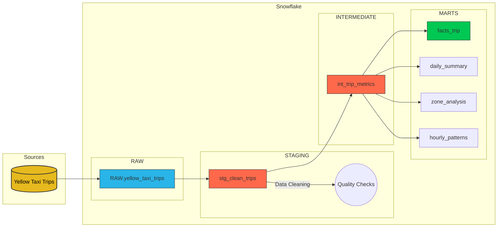

<div align="center">

# 🚖 NYC Taxi Data Pipeline


</div>

## 📋 Project Overview

The **NYC Taxi Data Pipeline** is a modern data engineering project designed to ingest, process, and analyze massive datasets of New York City Yellow Taxi trips (2024–2025). Built with **Snowflake** as the data warehouse and **dbt Core** or **dbt Cloud** for transformation, this project demonstrates a production-grade ELT (Extract, Load, Transform) workflow.

This pipeline handles ~40 million records, transforming raw parquet data into business-ready insights about urban mobility, revenue trends, and traffic patterns.

---

## 🏗️ Architecture

The project follows a modular **RAW → STAGING → INTERMEDIATE → MARTS** architecture to ensure data quality, lineage, and scalability.

<div align="center">



</div>

### 🔹 Layer Descriptions
- **RAW:** Unmodified data loaded directly from S3/Parquet files.
- **STAGING:** Initial cleaning (filtering outliers, negative fares, handling NULLs).
- **INTERMEDIATE:** Business logic application (trip duration, speed calculation, time-of-day categorization).
- **MARTS:** Final analytical tables optimized for BI tools and reporting.

---

## 📊 Key Insights & Metics

The pipeline calculates critical KPIs to understand taxi operations:

| Metric | Description |
| :--- | :--- |
| **Trip Duration** | Calculated in minutes and seconds. |
| **Traffic Speed** | Average speed (MPH) to identify congestion. |
| **Revenue Logic** | Analysis of fares, tips, and surcharges. |
| **Temporal Patterns** | Categorization into "Rush Hour", "Overnight", "Weekend", etc. |

---

## 🚀 Getting Started

### Prerequisites
- **Snowflake Account** (Trial or Standard)
- **dbt Core** (`pip install dbt-snowflake`) or **dbt Cloud**
- **Python 3.8+**
- **Git**

### 1. Clone the Repository
```bash
git clone https://github.com/MichAdebayo/snowflake-dbt-pipeline-nyc-taxi.git
cd snowflake-dbt-pipeline-nyc-taxi
```

### 2. Configure Snowflake
Execute the setup scripts to create the necessary warehouses and databases:
```sql
-- Run in Snowflake Worksheet
CREATE WAREHOUSE NYC_TAXI_WH WITH WAREHOUSE_SIZE = 'XSMALL' AUTO_SUSPEND = 60;
CREATE DATABASE NYC_TAXI_DB;
CREATE SCHEMA NYC_TAXI_DB.RAW;
CREATE SCHEMA NYC_TAXI_DB.STAGING;
CREATE SCHEMA NYC_TAXI_DB.FINAL; -- or MARTS
```

### 3. Load Raw Data
Load the 2024-2025 Yellow Taxi Parquet files into `NYC_TAXI_DB.RAW.YELLOW_TAXI_TRIPS` using the Snowflake COPY command or the provided scripts.

### 4. Configure dbt
Update your `~/.dbt/profiles.yml` file:
```yaml
nyc_taxi_analysis:
  target: dev
  outputs:
    dev:
      type: snowflake
      account: <YOUR_ACCOUNT>
      user: <YOUR_USERNAME>
      password: <YOUR_PASSWORD>
      role: ACCOUNTADMIN
      database: NYC_TAXI_DB
      warehouse: NYC_TAXI_WH
      schema: public
      threads: 4
```

### 5. Run the Pipeline
```bash
dbt deps    # Install dependencies
dbt debug   # Test connection
dbt run     # Run all models
dbt test    # Run data quality tests
```

---

## 🛠️ Technologies Used

- **Data Warehouse:** Snowflake
- **Transformation:** dbt (Data Build Tool)
- **Orchestration:** GitHub Actions (Optional)
- **Version Control:** Git & GitHub
- **Language:** SQL (Jinja), Python

---

## 📈 Dashboarding (Coming Soon)
Future updates will include a Streamlit or Tableau dashboard connecting to the `FINAL` schema to visualize:
- 🗺️ **Heatmaps:** Pickup density by zone.
- 🕒 **Peak Hours:** Demand analysis by time of day.
- 💸 **Revenue:** Daily and monthly revenue trends.

---

## 👤 Author
**Michael Adebayo**  
*Data Engineer*